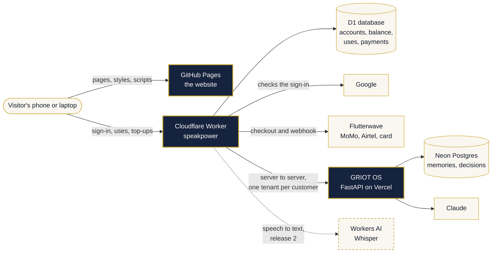
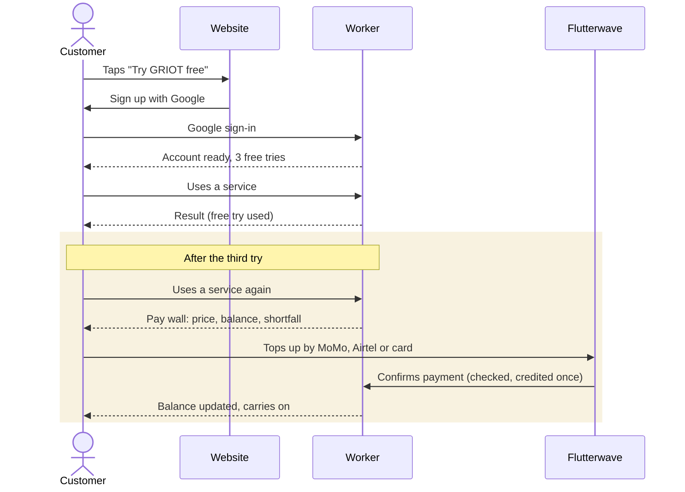
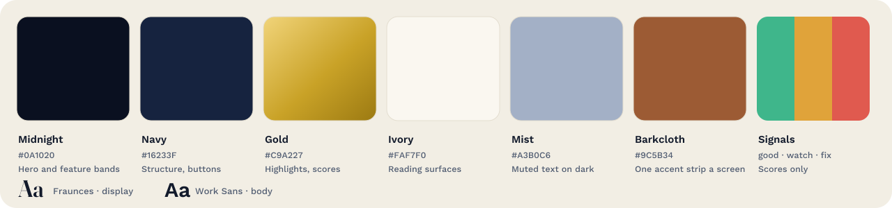

<p align="center">
  <a href="https://speakpower-commits.github.io/SpeakPower/">
    
  </a>
</p>

<p align="center">
  <a href="https://speakpower-commits.github.io/SpeakPower/"></a>
  
  <a href="#testing"></a>
  
</p>

**SpeakPower helps leaders in Kampala and across East Africa pitch, present and persuade.**
It pairs a human practice (communication strategy, public speaking, brand narrative) with tools people can use on their own phone, any time: **GRIOT**, *the storyteller who remembers you*, a strategy advisor that keeps your goals between conversations; Studio builders that turn a few answers into a usable first draft; and, next, an AI rehearsal coach.

> **Live preview:** [speakpower-commits.github.io/SpeakPower](https://speakpower-commits.github.io/SpeakPower/) · **Founder:** Otieno Thomas · *Articulate is key.*

<p align="center">
  
</p>

## What people can do here

| Product | What it does | Price | Status |
|---|---|---|---|
| **Rehearsal Room** | Speak for up to three minutes; get pace, fillers, pauses, a Speak Score and a stronger opening line | UGX 5,000 a rehearsal | Release 2 |
| **GRIOT** | A strategy advisor that remembers your goals and labels fact from inference | UGX 2,500 a message (monthly bundles in release 6) | Live; workspace in build |
| **Studio builders** | Brand Story, Website SEO Audit, Market Plan, SEO Content Starter, Data Story, Speaker Ready Pack | UGX 75,000 to 125,000 | Live |
| **Coaching with Otieno** | Human-led preparation for the rooms that cannot go wrong | On enquiry | Live |
| **Clarity Audit** | Free in-browser check of a pitch or document: readability, jargon, evidence | Free | Live |

**Everyone starts with 3 free tries, on anything.** After that, one balance pays for every service. It tops up by MTN MoMo, Airtel Money or card, and each use takes exactly its price. A failed use is refunded in full.

## How it fits together



- **The website is static.** Plain HTML, CSS and JavaScript on GitHub Pages: no build step, no framework, fast on mobile data.
- **The Worker holds every secret.** Sign-in, balances, payments and the GRIOT key all live server-side. Nothing in the browser can spend money or read another customer's data.
- **GRIOT never meets the browser.** The Worker calls it server-to-server, under that customer's own tenant, so one client's memories never mix with another's.

## A customer's journey



## Repository map

```text
.
├── index.html · services.html · work.html · about.html · contact.html   marketing pages
├── studio.html · studio-product.html/.js                                Studio catalogue and builders
├── studio-griot.html · griot-app.html/.js                               GRIOT page and chat
├── account.html · account.js · account-page.js                          sign-up, balance, top-ups
├── audit.html · audit.js                                                free Clarity Audit (runs in the browser)
├── styles.css · home.css · commercial.css · *.css                       design system and page styles
├── script.js · site-config.js                                           shared behaviour; public settings
├── sitemap.xml · robots.txt · llms.txt                                   for search engines and AI assistants
├── assets/                                                              photos, logos, README illustrations
│   └── brand/griot/                                                     GRIOT marks (SVG for the site; PNG and PDF for Canva)
└── worker/                                                              the Cloudflare Worker
    ├── worker.js · schema.sql · wrangler.toml
    ├── test/                                                            Node and workerd suites
    └── README.md                                                        step-by-step operations guide
```

## Configuration

- **`site-config.js`** holds the website's public settings: `apiBase` (the Worker's address) and `googleClientId`, plus switches for email codes and Turnstile. Nothing in it is secret.
- **`worker/wrangler.toml`** holds the Worker's public variables: allowed origin, free tries, top-up amounts, GRIOT address, Google client ID.
- **Worker secrets** are set in Cloudflare → *speakpower* → Settings → **Variables and Secrets** (the top, runtime section), type *Secret*. They are never written in this repository:

  | Secret | Used for |
  |---|---|
  | `SESSION_SECRET` | signing sign-in sessions (32+ random characters) |
  | `GRIOT_API_KEY` | the Worker's server-to-server key for GRIOT |
  | `FLW_SECRET_KEY` · `FLW_SECRET_HASH` | Flutterwave checkout and webhook checks |
  | `PAGESPEED_KEY` | optional: Lighthouse scores in the SEO audit |
  | `ANTHROPIC_API_KEY` | release 2: written feedback in the Rehearsal Room |

## Deploying

| What | Where | Updates when |
|---|---|---|
| Website | GitHub Pages, branch `claude/studio-griot-live` (preview), then `main` | every push |
| Worker `speakpower` | Cloudflare Workers Builds, root folder `worker` | every push |
| GRIOT OS | Vercel, from its own repository | every push to that repository |

> **Lesson from 7 October 2026:** if pushes never start a Worker build, the build settings are not the problem. Check that the **Cloudflare Workers and Pages** GitHub app can see this repository at [github.com/settings/installations](https://github.com/settings/installations). Each push should then show a "Workers Builds" check.

Full setup, step by step: [`worker/README.md`](worker/README.md).

## Testing

| Suite | What it proves |
|---|---|
| **Worker logic** (`worker/test/run-tests.mjs`, 103 checks) | prices match the site; free tries; exact charge and refund; parallel uses never overdraw; payments credited exactly once; sign-in; the SEO audit's address guard |
| **Worker on workerd** (`worker/test/run-workerd-tests.mjs`, 14 checks) | the same Worker on Cloudflare's real runtime, with D1 and the HTML reader |
| **Browser end to end** (69 checks) | Try → sign up → use → pay wall → top up → balance, on desktop and phone |
| **Site structure** | every page parses, local links resolve, structured data is valid |

## Design system

<p align="center"></p>

**Midnight & Gold.** SpeakPower's navy, gold and Fraunces, given more depth: midnight for the moments that sell, warm ivory for reading, gold for what matters. Barkcloth brown is the one accent from home, used at most once per screen. Signal colours appear only inside scores. Every text colour pair meets WCAG AA contrast. Tokens live in `styles.css`.

### GRIOT's marks

<p align="center">
  
  &nbsp;&nbsp;&nbsp;
  
</p>

GRIOT is named after West Africa's griot (*jeli*): the keeper of memory, adviser to leaders and storyteller. It has two marks with two jobs:
- **The Griot** is the signature. A portrait in a ring of *bogolan* marks (Mali's mud cloth) on barkcloth brown (Buganda's *lubugo*). Its nine dots are GRIOT's nine steps. It introduces GRIOT, at most once per screen.
- **The G** is the symbol: glasses and a smile drawn as a G, clean enough for a 16 px browser tab.

**Slogans:**
- Everyday line: *"The storyteller who remembers you."*
- Manifesto: *"A library that never burns."*, after Amadou Hampâté Bâ at UNESCO, 1960: "In Africa, when an elder dies, a library burns."


## Roadmap

| Release | What ships | Status |
|---|---|---|
| 1 | Midnight & Gold on every page, new Home and Studio, this README | on the preview |
| 2 | Rehearsal Room with the live Speak Score | planned |
| 3 | Sign-up profile (who you are, your challenge); GRIOT briefed from day one | planned |
| 4 | GRIOT workspace: lenses, memory, conversations, decisions | planned |
| 5 | Documents for GRIOT, cited by page | planned |
| 6 | Monthly bundles; the animated GRIOT mark | planned |

## Principles

- **Proof before claims.** Case studies follow *Problem → Strategy → Build → Outcome*, and numbers appear only when they are documented and attributable.
- **Secrets stay server-side.** No key, token or password in any file the browser can read.
- **Private by default.** The Clarity Audit runs in the browser; documents are never uploaded. Rehearsal audio is scored, then discarded.
- **Findable by people and by AI.** Every page has a title, description, canonical URL, Open Graph tags and structured data, plus `sitemap.xml`, `robots.txt` and `llms.txt`.

## Contact

**Otieno Thomas** · SpeakPower, Kampala, Uganda
thomasotieno583@gmail.com · +256 743 482 588 · [WhatsApp](https://wa.me/256743482588)
